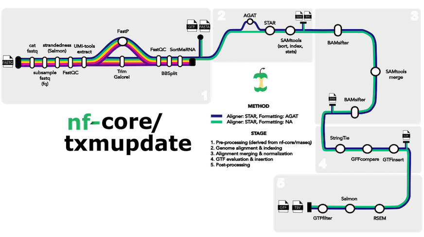

#  

[](https://nf-co.re/rnaseq/results)[](https://doi.org/10.5281/zenodo.1400710)

[](https://www.nextflow.io/)
[](https://docs.conda.io/en/latest/)
[](https://www.docker.com/)
[](https://sylabs.io/docs/)
[](https://tower.nf/launch?pipeline=https://github.com/nf-core/rnaseq)

[](https://nfcore.slack.com/channels/rnaseq)[](https://twitter.com/nf_core)[](https://mstdn.science/@nf_core)[](https://www.youtube.com/c/nf-core)

## Introduction

**nf-core/txmupdate** is a bioinformatics pipeline that can be used refine reference transcriptome annotations utilizing RNA sequencing data. It takes a samplesheet and FASTQ files as input, performs quality control (QC), trimming and STAR alignment, BAM processing and normalization, and a GFF comparison/insertion step.



0. Standardize GTF/GFF input format [`AGAT`](https://github.com/NBISweden/AGAT)
1. Merge re-sequenced FastQ files ([`cat`](http://www.linfo.org/cat.html))
2. Sub-sample FastQ files and auto-infer strandedness ([`fq`](https://github.com/stjude-rust-labs/fq), [`Salmon`](https://combine-lab.github.io/salmon/))
3. Read QC ([`FastQC`](https://www.bioinformatics.babraham.ac.uk/projects/fastqc/))
4. UMI extraction ([`UMI-tools`](https://github.com/CGATOxford/UMI-tools))
5. Adapter and quality trimming ([`Trim Galore!`](https://www.bioinformatics.babraham.ac.uk/projects/trim_galore/))
7. Removal of ribosomal RNA ([`SortMeRNA`](https://github.com/biocore/sortmerna))
8. Read Alignment to Reference [`STAR`](https://github.com/alexdobin/STAR)
9. Normalize coverage depth of alignemnts [`Bamsifter`](https://github.com/trinityrnaseq/bamsifter)
10. Sort, merge, and index alignments ([`SAMtools`](https://sourceforge.net/projects/samtools/files/samtools/))
11. Generate trancsript products from alignments ([`StringTie`](https://ccb.jhu.edu/software/stringtie/))
12. Compare transcript constructs against reference ([`GFFCompare`](https://github.com/gpertea/gffcompare)
13. Transcript insertion - GTF/GFF re-writing [`GTF_INSERT`](https://github.com/Riley-Grindle/gtf_insert)
15. Pseudo-alignment and quantification ([`Salmon`](https://combine-lab.github.io/salmon/); _optional_)


## Usage

> **Note**
> If you are new to Nextflow and nf-core, please refer to [this page](https://nf-co.re/docs/usage/installation) on how
> to set-up Nextflow. Make sure to [test your setup](https://nf-co.re/docs/usage/introduction#how-to-run-a-pipeline)
> with `-profile test` before running the workflow on actual data.

First, prepare a samplesheet with your input data that looks as follows:

**samplesheet.csv**:

```csv
sample,fastq_1,fastq_2,strandedness
CONTROL_REP1,AEG588A1_S1_L002_R1_001.fastq.gz,AEG588A1_S1_L002_R2_001.fastq.gz,auto
CONTROL_REP1,AEG588A1_S1_L003_R1_001.fastq.gz,AEG588A1_S1_L003_R2_001.fastq.gz,auto
CONTROL_REP1,AEG588A1_S1_L004_R1_001.fastq.gz,AEG588A1_S1_L004_R2_001.fastq.gz,auto
```

Each row represents a fastq file (single-end) or a pair of fastq files (paired end). Rows with the same sample identifier are considered technical replicates and merged automatically. The strandedness refers to the library preparation and will be automatically inferred if set to `auto`.

> **Warning:**
> Please provide pipeline parameters via the CLI or Nextflow `-params-file` option. Custom config files including those
> provided by the `-c` Nextflow option can be used to provide any configuration _**except for parameters**_;
> see [docs](https://nf-co.re/usage/configuration#custom-configuration-files).

Now, you can run the pipeline using:

```bash
nextflow run nf-core/txmupdate \
    --input samplesheet.csv \
    --outdir <OUTDIR> \
    -profile <docker/singularity/.../institute>
```


## Contributions and Support

If you would like to contribute to this pipeline, please see the [contributing guidelines](.github/CONTRIBUTING.md).

You can cite the `nf-core` publication as follows:

> **The nf-core framework for community-curated bioinformatics pipelines.**
>
> Philip Ewels, Alexander Peltzer, Sven Fillinger, Harshil Patel, Johannes Alneberg, Andreas Wilm, Maxime Ulysse Garcia, Paolo Di Tommaso & Sven Nahnsen.
>
> _Nat Biotechnol._ 2020 Feb 13. doi: [10.1038/s41587-020-0439-x](https://dx.doi.org/10.1038/s41587-020-0439-x).
